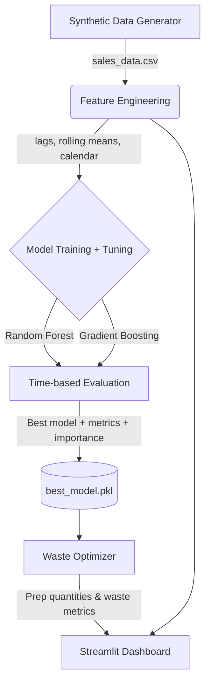

# Smart Restaurant Food Demand Prediction System 🍔📈

[](https://github.com/The-AlphaWolf/Restaurent-management/actions/workflows/ci.yml)
[](https://www.python.org/downloads/)
[](https://scikit-learn.org/)
[](https://streamlit.io)
[](https://github.com/astral-sh/ruff)

> **An end-to-end machine-learning system that forecasts daily per-item restaurant demand and turns those forecasts into concrete, rupee-optimal prep quantities — cutting food-waste cost by ~57–61% versus a cautious max-prep baseline. Validated on both a synthetic 3-year simulation *and* real daily restaurant data.**

🔗 **[Live Demo (Streamlit Community Cloud)](#)** — _replace with your Streamlit Cloud URL after deploying (see [Deployment](#-deployment-to-streamlit-community-cloud))._

📊 **[Full results report with charts →](RESULTS.md)** (auto-generated for both datasets)

---

## 📖 Problem Statement

Restaurants run on thin margins where two mistakes are constantly in tension:

- **Over-prep** → spoilage, wasted ingredients, lost money, environmental cost.
- **Under-prep** → stockouts, disappointed customers, lost sales.

Most kitchens manage this by hand — usually by over-preparing "to be safe," which quietly wastes a large share of food. This project forecasts demand per menu item per day, then converts each forecast into a **recommended prep quantity** with a tunable safety margin, letting an owner deliberately choose their point on the waste-vs-availability curve instead of guessing.

## 🏗️ Architecture



## 🧠 Approach & Key Decisions

### 1. Realistic synthetic data — a deliberate engineering choice
Granular restaurant sales data is rarely open-source, so I generated **3 years (1,095 days) of daily sales for 19 menu items across 4 categories**. This is not random noise — the generator ([`src/data_generation.py`](src/data_generation.py)) layers real demand structure so the modelling problem is genuine:

| Signal | How it's modelled |
|---|---|
| **Weekly seasonality** | Fri/Sat/Sun get a ~1.5× multiplier; slow weekdays ~0.8×. |
| **Yearly seasonality** | A sine-wave "temperature" drives season-sensitive items (soups/coffee peak in winter, salads/lemonade in summer). |
| **Growth trend** | A linear popularity factor (1.0 → 1.3) simulates the restaurant getting busier over 3 years. |
| **Holiday spikes** | Targeted ~1.3× surges on 7 holidays (Valentine's, Christmas, NYE, …). |
| **Realistic noise** | Demand is drawn from a **Poisson** distribution → non-negative integer counts with realistic variance. |

Everything is seeded (`np.random.seed(42)`) so results are fully reproducible.

### 2. Feature engineering (no data leakage)
All features come from information available **before** the day being predicted ([`src/features.py`](src/features.py)):

| Feature | Why it's there |
|---|---|
| `lag_1`, `lag_7`, `lag_14` | Demand is autocorrelated — yesterday and same-day-last-week are strong signals. |
| `rolling_mean_7`, `rolling_mean_14` | Smoothed recent demand level (shifted by 1 day so today never leaks into its own average). |
| `day_of_week`, `month` | Capture weekly and yearly seasonality directly. |
| `is_weekend`, `is_holiday` | Explicit flags for the biggest, sharpest spikes. |
| `trend_index` | Monotonic day counter so trees can learn the growth trend. |
| `temperature`, `price` | Environmental / item drivers. |
| `category` (one-hot), `item_id` (encoded) | Identify which item/category a row belongs to. |

### 3. Modelling — two well-understood models, tuned properly
I compare **Random Forest** vs. **Histogram Gradient Boosting** — both pure scikit-learn, so the project has **no native/C dependencies** and runs identically on Windows, Linux, and Streamlit Cloud.

Methodology that matters ([`src/train.py`](src/train.py)):
- **Time-based split** — train on `< 2023-07-01`, test on the final 6 months. No shuffling of a time series.
- **`RandomizedSearchCV` with `TimeSeriesSplit`** — hyperparameters are tuned with forward-chaining cross-validation, so validation folds are always *after* their training folds (no peeking into the future). Search spaces are documented in-code.
- **Naive baseline** ("same as last week", i.e. `lag_7`) so the model's added value is explicit.
- **Permutation importance** on the held-out test set (a model-agnostic, leakage-resistant importance measure).

### 4. Results (held-out last 6 months)

| Model | MAE | RMSE | MAPE | R² |
|---|---|---|---|---|
| Naive baseline (last week) | 8.23 | 10.96 | 32.6% | 0.589 |
| Random Forest ✅ *(selected)* | **6.06** | **8.04** | **24.8%** | **0.779** |
| Gradient Boosting | 6.06 | 8.06 | 24.9% | 0.777 |

**The tuned model cuts forecast error (MAE) by ~26% versus the naive baseline.** Top demand drivers by permutation importance: `rolling_mean_14`, `day_of_week`, `is_weekend`, `lag_7`.

### 5. 💰 Business impact — the Waste Optimizer
Predictions feed [`src/waste_optimizer.py`](src/waste_optimizer.py), which compares two prep strategies over the test period:

- **Baseline:** prep the **max sold in the last 14 days** (what a cautious manager does to avoid ever running out — safe, but very wasteful).
- **ML:** prep `predicted demand × (1 + safety margin)`.

Because the ML strategy tracks demand instead of always assuming the worst case, it can hit the **same stockout (service) level as the baseline while wasting far less food**:

| Safety margin | Waste reduction vs baseline | Stockouts vs baseline |
|---|---|---|
| 10% | **~78%** | higher (aggressive, waste-minimising) |
| 30% | **~57%** | **≈ matched** service level |

> **Headline: at an equivalent service level, ML-driven prep cuts simulated food waste by ~57%.** The dashboard's safety-margin slider lets an owner move along this curve to match their own waste-vs-availability preference.

### 6. 💰 Cost-optimal margin in Rupees (₹)
Units are not the real objective — money is. The cost module ([`waste_optimizer.py`](src/waste_optimizer.py)) prices both failure modes in INR and picks the margin that **minimises total cost**:

- **Waste cost** = wasted units × item **food cost** (ingredients you paid for and binned).
- **Stockout cost** = unmet demand × item **profit margin** (`selling_price − food_cost`).

Sweeping the safety margin produces a U-shaped cost curve with a clear optimum:

| Dataset | Cost-optimal margin | Baseline cost | ML cost | Saving |
|---|---|---|---|---|
| Synthetic | 10% | ₹76.5L | ₹29.5L | **~61%** |
| Real (Recruit) | 15% | ₹2.0Cr | ₹85.2L | **~57%** |

_(INR prices per item are defined in the menu; for the real visitor dataset an average-check per cuisine genre is assumed and documented in [`prepare_real_data.py`](src/prepare_real_data.py).)_

### 7. ✅ Validated on real data
The exact same pipeline is run on **real daily restaurant visitor counts** (Recruit Restaurant, Japan — AirREGI POS). On genuinely messy real data the tuned model still **cuts forecast error ~23% vs the naive baseline** (MAE 9.25 → 7.16, R² 0.59). This proves the approach isn't overfit to a hand-crafted simulation. Switch between datasets live using the dashboard's sidebar selector.

## 📸 Dashboard

A Streamlit app ([`dashboard/app.py`](dashboard/app.py)) with a **dataset selector** (Synthetic / Real), sidebar navigation, and interactive Plotly charts:

1. **Overview** — historical demand trends, category mix, per-item drill-down.
2. **Predictions** — actual vs. predicted demand, per-category and per-item forecasts.
3. **Waste Insights** — the optimizer, an interactive safety-margin slider, and top waste-reduction opportunities.
4. **Cost Impact (INR)** — the ₹ cost-vs-margin curve, the cost-optimal margin, and a waste/stockout cost breakdown.
5. **Model Performance** — metrics table, tuned hyperparameters, and the permutation feature-importance chart.

> _Add screenshots here after running the app (replace the placeholders):_
> 
> 

## 🚀 Setup & Installation

### Local
```bash
git clone https://github.com/The-AlphaWolf/Restaurent-management.git
cd Restaurent-management

pip install -r requirements.txt

python src/data_generation.py        # 1. generate the synthetic dataset
python src/train.py                  # 2. train + tune on synthetic data

# Optional — add the real dataset (downloads ~9 MB once, then subsamples):
python src/prepare_real_data.py      # 3. fetch + prepare real restaurant data
python src/train.py --source real    # 4. train + tune on real data

python reports/generate_report.py    # 5. (optional) regenerate RESULTS.md + charts
streamlit run dashboard/app.py       # 6. launch the dashboard
```

### Docker
```bash
docker build -t restaurant-demand-app .
docker run -p 8501:8501 restaurant-demand-app
# open http://localhost:8501
```

### Tests & lint
```bash
pytest tests/ -q     # unit tests for data gen, features, prediction, waste logic
ruff check .         # linting
```
CI ([`.github/workflows/ci.yml`](.github/workflows/ci.yml)) runs both on every push/PR.

## 🌐 Deployment to Streamlit Community Cloud
The pre-generated `data/` and `models/` files are committed, so the app runs immediately with no build step.
1. Push this repo to a **public** GitHub repository.
2. Go to [share.streamlit.io](https://share.streamlit.io/) and sign in with GitHub.
3. **New app** → select the repo/branch → set **Main file path** to `dashboard/app.py`.
4. **Deploy**, then paste the resulting URL into the Live Demo link at the top of this README.

## 🔮 Future Improvements
- **Live features**: integrate a weather forecast API for true forward-looking inputs.
- **Multi-step forecasting**: predict a 7-day horizon at once instead of one day ahead.
- **Prediction intervals**: quantile regression to prep at, say, the 80th demand percentile.
- **Deep learning**: benchmark an LSTM / Temporal Fusion Transformer against the tree models.
- **Per-item spoilage windows**: some ingredients keep for days — model shelf life, not just next-day waste.

## 🗂️ Project Structure
```
├── src/
│   ├── datasets.py          # dataset registry (synthetic/real paths + split)
│   ├── data_generation.py   # synthetic data generator (INR menu)
│   ├── prepare_real_data.py # fetch + adapt real Recruit Restaurant data
│   ├── features.py          # feature engineering (lags, rolling, calendar) + split
│   ├── train.py             # training, tuning, evaluation, model saving (--source)
│   ├── predict.py           # load model + score new data
│   └── waste_optimizer.py   # prep quantities, waste metrics, INR cost optimizer
├── dashboard/app.py         # Streamlit app (dataset toggle, 5 sections)
├── reports/generate_report.py  # builds RESULTS.md + figures
├── tests/test_core.py       # pytest unit tests
├── data/                    # generated + real CSVs (committed for the live demo)
├── models/                  # best_model.pkl (synthetic) + best_model_real.pkl
├── RESULTS.md               # auto-generated results report
├── .github/workflows/ci.yml # lint + tests
├── Dockerfile
└── requirements.txt
```
