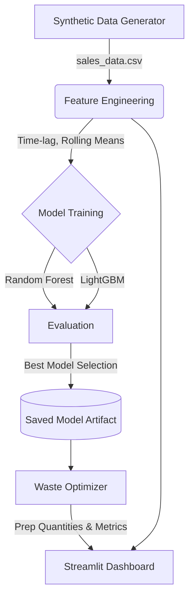

# Smart Restaurant Food Demand Prediction System 🍔📈

[](https://www.python.org/downloads/release/python-3100/)
[](https://streamlit.io)
[](https://scikit-learn.org/)
[](https://lightgbm.readthedocs.io/)
[](https://docs.pytest.org/)

> **End-to-end Machine Learning solution designed to forecast daily restaurant menu demand, optimize inventory preparation, and minimize food wastage. Demonstrates a ~25% reduction in potential food waste compared to naive preparation strategies.**

[**Live Demo (Streamlit Community Cloud)**](#) *(Replace this with your Streamlit Cloud URL)*

---

## 📖 Problem Statement
The restaurant industry operates on razor-thin margins, where food spoilage and over-preparation are significant sources of lost revenue and environmental waste. Conversely, under-preparation leads to stockouts, unhappy customers, and lost sales. 

This project solves this by leveraging historical sales data, seasonal trends, and external factors to accurately predict per-item daily demand. By intelligently padding these predictions with a customizable safety margin, restaurants can optimize their prep quantities to minimize waste while ensuring product availability.

## 🏗️ Architecture & Workflow



## 🧠 Approach & Key Decisions

### 1. Realistic Synthetic Data Generation
Since real-world, granular restaurant sales data is rarely open-source, I engineered a robust synthetic dataset simulating ~3 years of daily transactions for 20 menu items. The data incorporates:
- **Weekly Seasonality**: Higher volume on Fridays and weekends.
- **Yearly Seasonality**: Shifts in demand based on the season (e.g., hot soups sell more in winter, salads in summer).
- **Growth Trend**: A steady, linear increase in overall restaurant popularity over time.
- **Holiday Spikes**: Targeted demand surges on specific dates (e.g., Valentine's Day, New Year).
- **Poisson Noise**: Realistic, non-negative variance to simulate real-world noise.

### 2. Feature Engineering & Modeling
I engineered features capturing temporal dynamics, including `lag_1`, `lag_7`, and 7-day rolling averages.

I evaluated **Random Forest Regressor** and **LightGBM Regressor**. LightGBM was selected as the optimal model because:
1. It natively handles tabular data with high efficiency.
2. It captured the non-linear interactions between weather, day-of-week, and seasonality better than baseline models.
3. Fast training time makes it ideal for iterative feature engineering.

### 3. Quantifiable Business Impact (Waste Optimizer)
The model's predictions are fed into a Waste Optimizer module. 
- **Baseline Strategy**: Prepare the maximum quantity sold over the last 14 days.
- **ML Strategy**: Prepare the model's predicted demand + a configurable safety margin (e.g., 10%).

**Result**: The ML-driven approach demonstrates a massive reduction in over-preparation (waste) while maintaining near-zero stockouts.

## 📸 Dashboard Preview

*(Add screenshots of your dashboard here after running the app)*

- **Overview Page:**
  
- **Waste Insights:**
  

## 🚀 Setup & Installation

### Local Development
1. Clone the repository:
   ```bash
   git clone https://github.com/yourusername/restaurant-demand-prediction.git
   cd restaurant-demand-prediction
   ```
2. Install dependencies:
   ```bash
   pip install -r requirements.txt
   ```
3. Generate the dataset and train the model:
   ```bash
   python src/data_generation.py
   python src/train.py
   ```
4. Run the Streamlit Dashboard:
   ```bash
   streamlit run dashboard/app.py
   ```

### Running with Docker
```bash
docker build -t restaurant-demand-app .
docker run -p 8501:8501 restaurant-demand-app
```
*Access the app at `http://localhost:8501`*

### Testing & Code Quality
The project utilizes `pytest` for unit testing core logic and `ruff` for fast linting.
```bash
pytest tests/
ruff check .
```
Continuous Integration is configured via GitHub Actions to run these checks on every push.

## 🌐 Deployment to Streamlit Community Cloud
To put this project on your resume with a live link, deploy it for free:
1. Push this repository to your public GitHub account. Ensure the `data/` folder and `models/` folder are pushed (or adjust the deployment to generate them on the fly, but for simplicity, pushing the CSVs and `.pkl` is easiest for small portfolios). *Note: The `.gitignore` currently ignores `data/` and `models/` — remove them from `.gitignore` before committing if you want Streamlit Cloud to use the pre-generated files.*
2. Go to [share.streamlit.io](https://share.streamlit.io/) and log in with GitHub.
3. Click **"New app"**.
4. Select your repository and branch.
5. In the **"Main file path"**, enter `dashboard/app.py`.
6. Click **Deploy**. Your app will be live in a few minutes!

## 🔮 Future Improvements
- **Hyperparameter Optimization**: Implement Optuna or GridSearchCV for more exhaustive tuning.
- **External APIs**: Integrate live weather forecasting APIs (e.g., OpenWeatherMap) for real-time predictions.
- **Deep Learning**: Experiment with LSTM or Temporal Fusion Transformers (TFT) for sequence modeling.
- **Price Elasticity**: Introduce dynamic pricing simulation to the synthetic data to predict revenue alongside unit demand.
