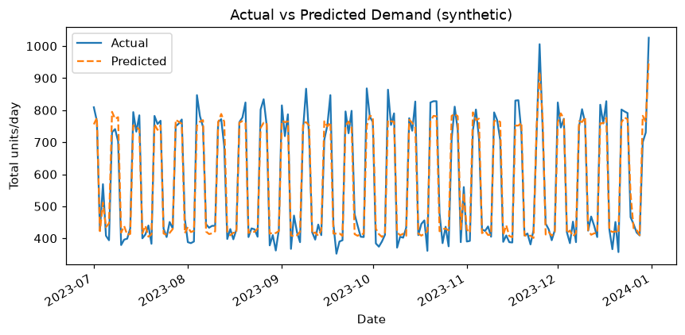
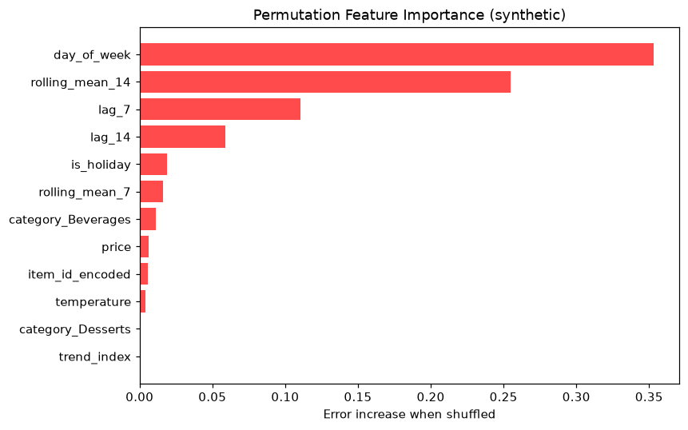
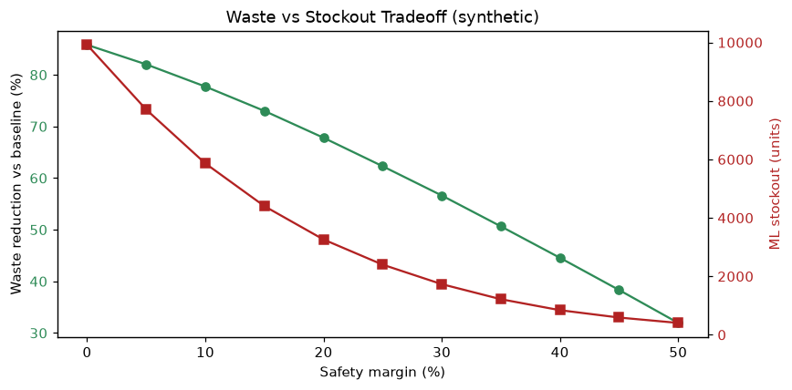
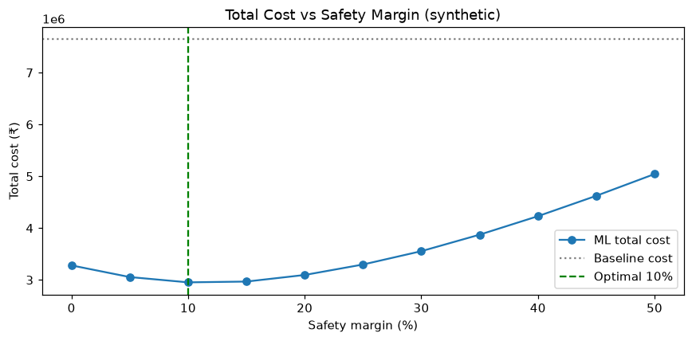
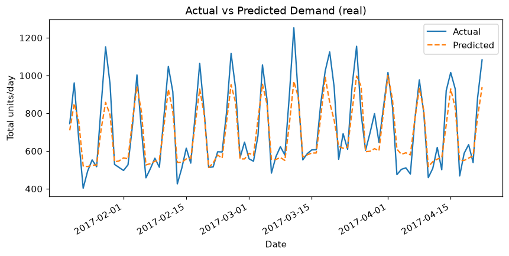
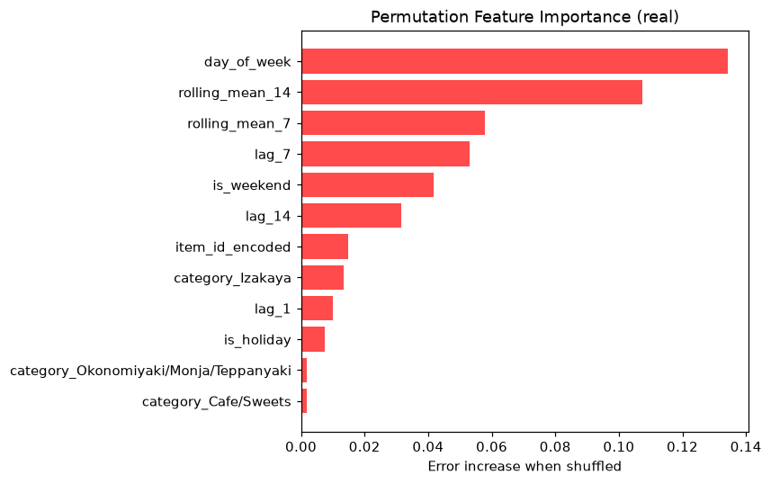
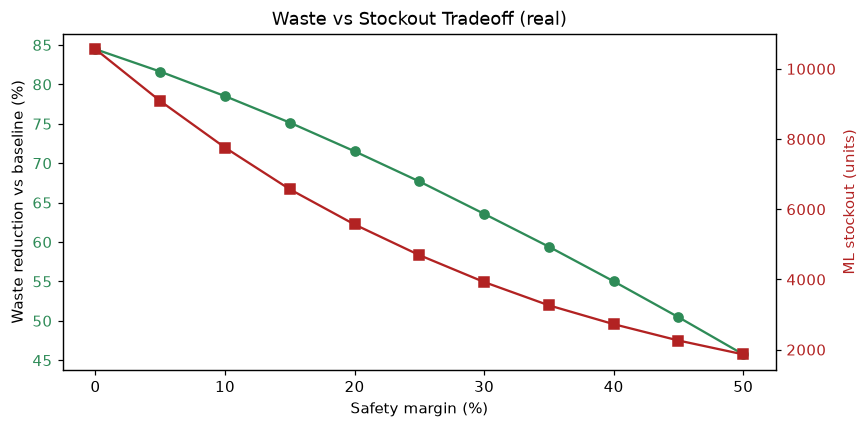
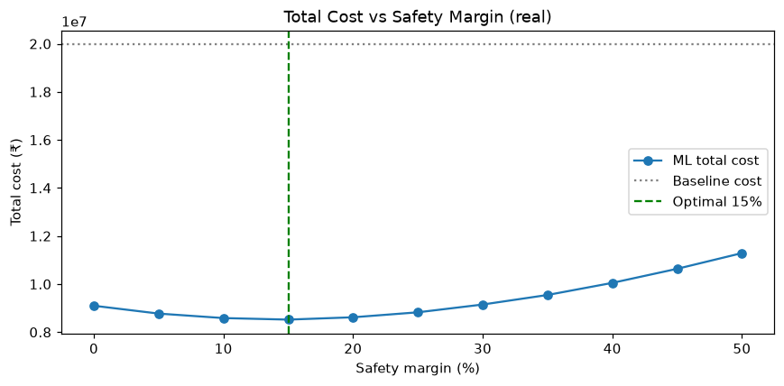

# 📊 Results Report

_Auto-generated by `python reports/generate_report.py`. All figures are produced from the held-out test period of each dataset._

The same pipeline is evaluated on a **synthetic 3-year simulation** and on **real daily restaurant visitor data** (Recruit Restaurant, Japan), showing the approach generalises beyond hand-crafted data.

---

## Synthetic (3-year simulation)

**Selected model:** Gradient Boosting &nbsp;·&nbsp; **Forecast error cut vs naive baseline:** 26.4% (MAE 8.23 → 6.06)

| Model | MAE | RMSE | MAPE | R² |
|---|---|---|---|---|
| Naive baseline | 8.23 | 10.96 | 32.5% | 0.589 |
| Random Forest | 6.07 | 8.07 | 24.9% | 0.777 |
| Gradient Boosting | 6.06 | 8.06 | 25.0% | 0.778 |

### What drives demand

### Waste vs stockout tradeoff
The safety-margin slider trades food waste against stockouts. Higher margins prep more, wasting more but rarely running out.

### Cost-optimal safety margin (INR)
Minimising total rupee cost (waste ingredient cost + lost-margin on stockouts) selects a **10% safety margin**, cutting cost from **₹7,645,672** (baseline) to **₹2,953,603** — a **61% saving** (₹4,692,069), with **78% less waste**.

---

## Real (Recruit Restaurant, Japan)

**Selected model:** Random Forest &nbsp;·&nbsp; **Forecast error cut vs naive baseline:** 22.6% (MAE 9.25 → 7.16)

| Model | MAE | RMSE | MAPE | R² |
|---|---|---|---|---|
| Naive baseline | 9.25 | 12.50 | 59.3% | 0.347 |
| Random Forest | 7.16 | 9.89 | 51.3% | 0.591 |
| Gradient Boosting | 7.31 | 10.22 | 48.6% | 0.563 |

### What drives demand

### Waste vs stockout tradeoff
The safety-margin slider trades food waste against stockouts. Higher margins prep more, wasting more but rarely running out.

### Cost-optimal safety margin (INR)
Minimising total rupee cost (waste ingredient cost + lost-margin on stockouts) selects a **15% safety margin**, cutting cost from **₹19,973,500** (baseline) to **₹8,521,480** — a **57% saving** (₹11,452,020), with **75% less waste**.

